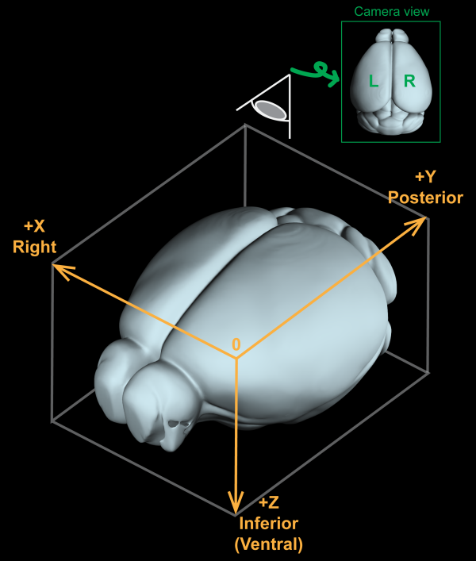

# About brain coordinates

Brain coordinates used in ecc follows that of the CUBIC-Atlas, which is defined by
  * Raw camera image (horizontal section) is viewed from the dorsal side. This means that anatomical left hemisphere comes to the left-hand side of the image.
  * X axis is left-right axis, where x becomes larger as it goes to right
  * Y axis is anterior-posterior axis, where y becomes larger as it goes to posterior
  * Z axis is dorsal-ventral axis, where z becomes larger as it goes to ventral

**All image data must follow this coordinate and must be reoriented accordingly so that it can be analyzed.**

Above definition is summarized in the image below:

