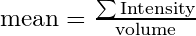

# Segmenting cells

To extract individual cells from the probability image, use `CellFinder` class from `cloudmap.ecc.cellfinder_parallel`.

## Example script

```python
from ecc.cellfinder import CellFinder

# create a new instance
cf = CellFinder()

# force it print detailed progress
cf.set_verbose(True)

# Optional: set number of parallel CPU cores
cf.set_num_workers(4)

# Optional: set block size
cf.set_block_size({"blocksize": 120, "overlap": 20})

# set voxel size of the input image
cf.set_image_voxel_size( {"X": 6.45, "Y": 6.45, "Z": 7.0} )

# set some parameters
cf.set_prob_threshold(0.70)
cf.set_min_particle_volume(2)
cf.set_max_particle_volume(64)
cf.set_intensity_computation_mode('obj_mean')

# Optional: give it a nice nickname
cf.set_nickname('test')
# set output directory
cf.set_outdir('/data/cellfinder-result/')

cf.set_raw_image_path('/data/test-image.hdf5')
cf.set_prob_image_path('/data/classifier-result/prob_image.h5')

# run!
cf.run_main()
```

Tips:
{: .label .label-green }

To process multiple brains, add for loop in the above code.


## Some more explanation...

### Create a new instance
```python
from ecc.cellfinder import CellFinder
cf = CellFinder()
```

### (Optional) Set the number of parallel threads
You can control the number of threads allocated for this computation by
```python
cf.set_num_workers(4)
```
By default, ecc will try to use all of the CPU cores available on the system.

### (Optional) Set verbose
By telling `set_verbose(True)`, the detailed progress information is printed on the screen output. If you want a silent execution, give it a false value.
```python
cf.set_verbose(True)
```

### (Optional) Set blocksizes and overlaps
CellFinder divides the large 3D into small blocks and processes them in a parallel manner. You can adjust the block size and overlap value by
```python
cf.set_block_size({"blocksize": 120, "overlap": 20})
```
The default is `{"blocksize": 120, "overlap": 20}`, and you normally do not need to change this value.

### Set voxel size of the input image
First, set voxel size of the input image **sin &mu;m**:
```python
cf.set_image_voxel_size( {"X": 6.45, "Y": 6.45, "Z": 7.0} )
```
If you want silent execution, give verbose false value.

CAUTION
{: .label .label-yellow }

Do not put wrong voxel size here, or all subsequent analysis will fail!!

### Set counting paramters
```python
cf.set_prob_threshold(0.70)
cf.set_min_particle_volume(2)
cf.set_max_particle_volume(64)
cf.set_intensity_computation_mode('obj_mean')
```

`prob_threshold` literally means the thresholding value applied to the probability image. Voxels with larger values than threshold are considred as objects (i.e. cell). The value should be in range [0, 1].

`min_particle_volume` defines the minimum volume (in voxel unit, not in &mu;m<sup>3</sup>!) of the segmented objects. Objects smaller than this volume are ignored.

`max_particle_volume` defines the maximum volume (in voxel unit, not in &mu;m<sup>3</sup>!) of the segmented objects. Objects larger than this volume is sent to object separation routine, where the objects gets separeted into multiple objects.

`intensity_computation_mode` defines how the intensity value is computed for each cell. Available options are `max` and `obj_mean`. `max` simply picks up the maximum intensity value of the segmented object. `obj_mean` computes the mean intensity value of the segmented object, calculated as



Namely, to recover the total intensity of the object, simply multiply as mean intensity with volume.

### Set inputs and outpus
```python
cf.set_nickname('test')
cf.set_outdir('/data/cellfinder-result/')
cf.set_raw_image_path('/data/test-image.hdf5')
cf.set_prob_image_path('/data/classifier-result/prob_image.h5')
```

`nickname` is used to name files.

All output files will be written in the directory you specified by `cf.set_outdir()`.

Then, supply the paths to raw and probability image by calling `cf.set_raw_image_path()` and `cf.set_prob_image_path()`.

### (Optional) Set mask
Optionally, you can define a mask.
```python
cf.set_mask_image_path( '/data/counting/mask.hdf5s' )
```
Image mask should be given as chunked HDF5 format. Voxels with values equal or greater than 1 are regarded as mask area, and **voxels covered by the mask area are ignored**.

For example, when strong autofluorescence is present on the brain surface (which is often the case), you can generate a brain surface mask to exclude those signals.

### Run!
Now everything is ready. Start the calculation by
```python
cf.run_main()
```

Tips:
{: .label .label-green }
Given 15GB image volume, this computation takes about 10 to 30 minutes using 30 CPU cores.

### Inspect the output
In the output directory, you will find a csv table, named `{nickname}_cells.csv`, where nickname is the one that you defined.

In the table, each row will show the properties of one detected cell. The columns of this csv table will be

| X | Y | Z | deltaI | BG | vol | deltaI_total |

`X`, `Y`, `Z` are the center of the mass of the cell, following the coordinate convention defined [here](coordinate.html).

`deltaI` means the signal intensity, subtracted by background level. Depending on the `intensity_computation_mode` described above, it is either maximum or mean of the object.

`BG` is the background level. You can recover the original intensity by computing `deltaI + BG`.

`vol` is the volume of the cell.

`deltaI_total` is simply computed as `deltaI * vol`, corresponding to the total expression amount.