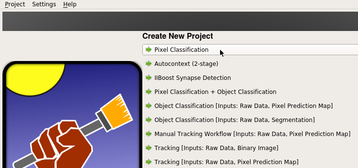
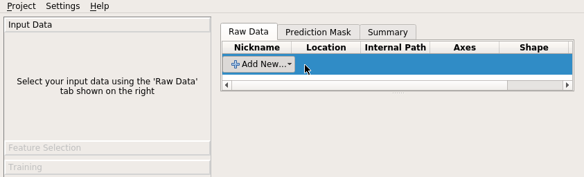
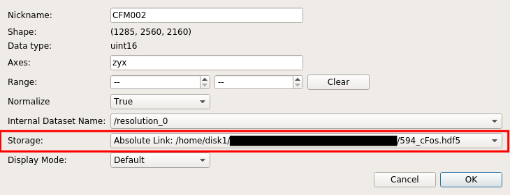
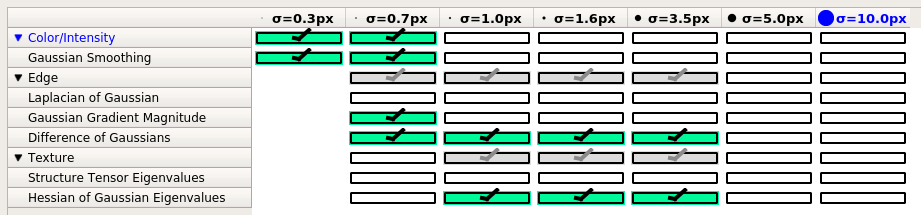
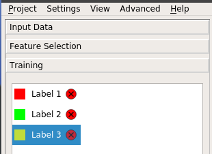
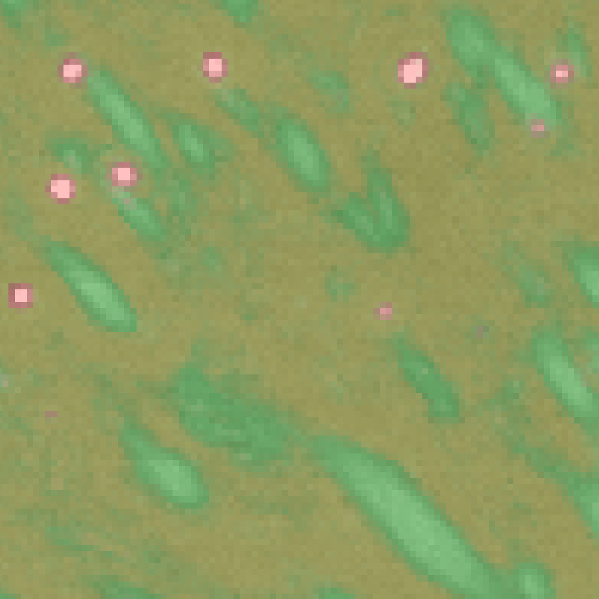
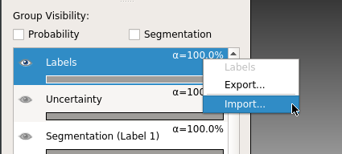
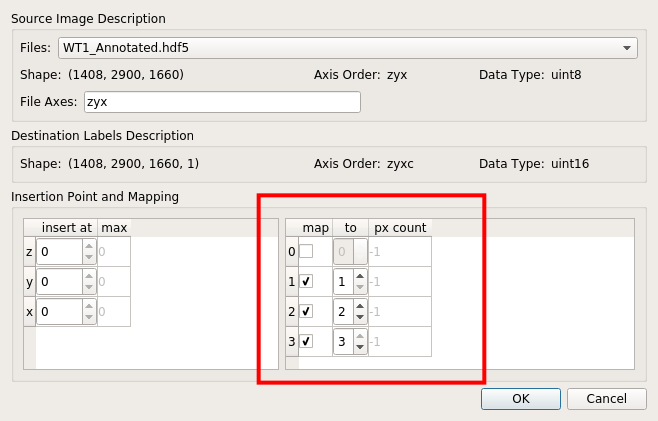

# Training ilastik classifier

ecc utilizes the pixel classifier implemented by [ilastik](https://www.ilastik.org/). ilastik offers a nice GUI which allows users to interactively annotate images and refine the classifier. The full documentation on ilastik software can be found in their [official documentation](https://www.ilastik.org/documentation/index.html).

In this step, we will use ilastik's GUI to train a pixel classifier. Once a good pixel classifier is trained, you can apply that classifier to a group of brains, using the `PixelClassifier` class from `ecc.ilastik_wrapper` module, which will be explained in [Applying ilastik classifier](classifier.html). The resulting "probability images" are then used to identify single cells.

It is recommend that users train independent classifier for each label. For example, given parvalbumin (PV) and somatostatin (Sst) immunostaining images, a separate classifier should be trained for each label (i.e. "PV classifier" and "Sst classifier"). This is because different antibody have different signal strength, background levels and non-specific staining patterns, and thus, it is hard to train a "generalized" classifier that works well against all labels. Once trained, PV classifier can be applied to other PV image, as long as the identical staining and imaging condition is used.

## ilastik training steps

### 1. Create a new ilastik project
First, launch ilastik GUI, and select "Pixel Casslfication" under "Create New Project".

### 2. Define input images
From ilastik GUI, set paths to the input images by which the classifier is trained.

Here, a chunked HDF5 file should be used. Using TIFF image stack should be avoided because of the slow data IO when viewing slices.

Training data should cover **all** of the image context present in whole brain image. Brain is a very heterogeneous organ, and image context (such as signal intensity and background level) may significantly differ depending on the brain region. For this reason, training image may want to be entire or hemisphere brain.

When importing input images, ilastik project holds the input image either by `absolute link` or `relative link` or `making a new copy`. `Absolute link` or `relative link` keeps the file size of the project file minimum by not making a duplicate copy. However, the entire project file becomes invalid if the path gets broken, so care must be taken when moving and copying the files. `making a new copy` is useful when making the ilastik project self-contained (eliminating worries about broken links), in exchange for larger file size. These options can be changed by "Input data" > (right click on the list) > "edit properties" > "Storage", as shown in the screenshot below:

ilastik allows users to have multiple input images. This will be useful to make the classifier more robust against image quality variations between samples. In [CUBIC-Cloud paper](), more than two different brains were annotated and used to train classifier.

### 3. Select features
From ilastik GUI, select image features that are used to learn and classify pixels.

Assuming 6.5 um isometric image resolution (as was done in CUBIC-Cloud paper), the recommended set of features are:

  * Gaussian (sigma=0.3, 0.7)
  * Gaussian Gradient Magnitude (sigma=0.7)
  * Difference of Gaussian (sigma=0.7, 1.0, 1.6, 3.5)
  * Hessian of Gassuian Eigenvalues (1.0, 1.6, 3.5)

Users may need to optimize the selection depening on their image resolution and image types.

### 4. Annotate images
Now, manually annotate pixels to create training data.

Usually, three labels should be defined:
  * 1 : Object of interest, (e.g. cell nuclei, cell bodies or Ab plaque)
  * 2 : False signals that have relatively strong intensity, such as bright neurites extending from cells or non-specific binding of antibodies on blood vessels or fiber bundles
  * 3 : Background

Caution!
{: .label .label-yellow }
**Label 1 must always be the object of interest! Otherwise ecc does not work!!**

Then, using the pen tool, start annotating pixels.

Some annotation tips are:
  * Boundary between labels (e.g. cell edges) should carefully and intensively annotated
  * Try to cover as many image context as possible. Also remember that in order for classifier to learn something, just "one example" is not enough. Similar image contexts should be annotated several times to have statistical effect.

How much annotation should be performed? There is unfortunately no clear answer to that question. Generally speaking (and quite obviously), more training data is better. In [CUBIC-Cloud paper]() more than 5000 voxels (corresponding to roughly 1000 cells) were annotated as label 1 (per one training session).

By clicking "Live Update" button in the GUI, you can quickly check how well the classifier is performing (like shown below). Use this preview as a guidance to refine your annotation.

### 5. Save ilastik project

Once a satisfactory classifier performance is obtained, remember to save the project file.

Now, proceed to [Applying ilastik classifier](classifier.html).

## Tips: Image annotation using ITK-SNAP

You can use ilastik's built-in GUI to create training data, as explained above. 

However, you may find the software's response a little too slow, especially when you are handling a very large 3D image.

To annotate a large 3D images, users may consider using a specialized software for image annotation, called [ITK-SNAP](http://www.itksnap.org/).

[ITK-SNAP](http://www.itksnap.org/) is a medical and biological image annotation tool, offered as a free and open-source software. It offers fast image rendering and useful palette of annotation tools. So, image annotation may become much quicker with ITK-SNAP.

The tricky part is that ITK-SNAP only accepts [NIfTI image format](https://nipy.org/nibabel/nifti_images.html), so users must convert their image data accordingly. This can be done by using ImageJ or writing a custom code. Further, ITK-SNAP outputs the annotation as NIfTI image. To import it in ilastik, it must be converted into compatible data format, such as HDF5.

Annotations prepared by ITK-SNAP can be imported into ilastik project by right-clicking **"labels"** > **"import..."**, as shown below.

Then from the pop-up window select the path to annotation data (usually in HDF5 format). At this step, **remember to properly map pixel values to label values, as shown below:**

